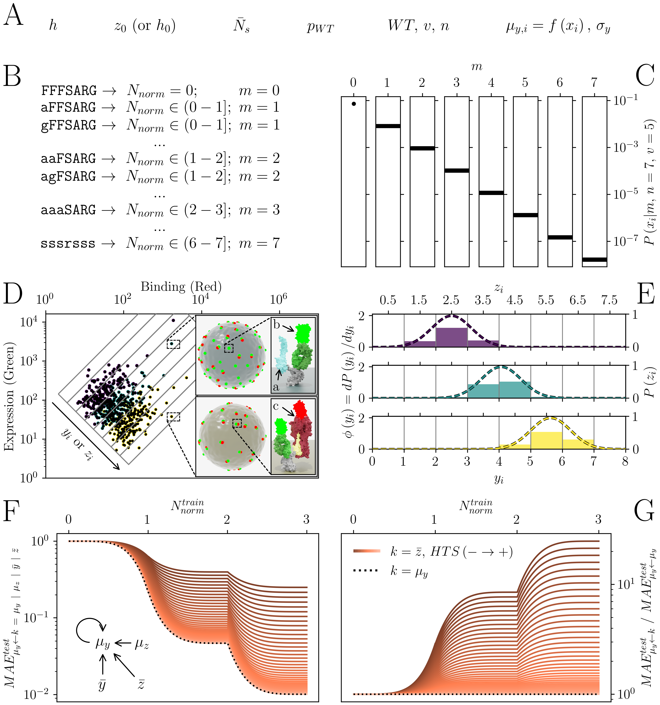

 # Impact of Interval Censoring on Data Accuracy and Machine Learning Performance in High-Throughput Screening Experiments

 Data, Python scripts, Results and Figures used in the publication entitled "Impact of Interval Censoring on Data Accuracy and Machine Learning Performance in Biological High-Throughput Screening" (--> [preprint]()).

 - [Overview](#overview)
 - [Requirements](#requirements)
 - [Citation](#citation)


 ## Overview
Abstract: High-throughput screening (HTS) combined with deep mutational scanning (DMS) and next-generation DNA sequencing (NGS) have great potential to accelerate discovery and optimization of biological therapeutics. Typical workflows involve generation of a mutagenized variant library, screening/selection of variants based on phenotypic fitness, and comprehensive analysis of binned variant populations by NGS. However, in such cases, impact of interval censoring the HTS data are subject to interval censoring, where each fitness value is calculated based on assignment of variants to bins. Such censoring leads to increased uncertainty, which can impact data accuracy and, consequently, the performance of machine learning (ML) algorithms tasked with predicting sequence-fitness pairings. Here, we investigated the impact of interval censoring on data quality and ML performance in biological HTS experiments. We theoretically analyzed the impact of data censoring and propose a dimensionless number, the *Ratio of Discretization* ($R_{D}$), to assist in optimizing HTS parameters such as the bin width and the sampling size. This approach can be used to minimize errors in fitness prediction by ML and to improve the reliability of these methods. These findings are not limited to biological HTS techniques and can be applied to other systems where interval censoring is an advantageous measurement strategy. 


*Overview of mutagenized library generation, FACS-based sorting and ML evaluation with interval-censored data. (A) Key parameters influencing interval censoring in FACS experiments. (B) Design of a combinatorial variant library derived from the parent peptide sequence FFSARG, with different mutation positions leading to variant distributions. (C) Example distribution of the combinatorial library, following a binomial distribution pattern based on the mutant frequency, where the probability of retaining the wild-type sequence ($p_{WT}$) was approximately 0.69. (D) Hypothetical FACS experiment designed to evaluate expression levels (green fluorescence) and binding affinity (red fluorescence) across variants. The first level zoom insets show two labeled cells expressing two variants (yellow and blue). The second level zoom insets show: (a) an unbound mutant peptide (blue), (b) labeled (green) expression antibody (dark green) bound to its tag (grey), and (c) labeled (red) target (dark red) bound to a mutant variant (yellow). (E) Example of population distributions of variants as determined by FACS. Dashed lines represent theoretical continuous distributions for each variant (true distributions), while the solid bars represent the binned/censored distributions (observed data). (F) Example comparison of mutant-based normalized LCs for models trained on interval-censored data ($\bar{z}_{i}$) versus models trained on true continuous data ($\mu_{y,i}$), with varying HTS parameters (color gradient). The inset depicts the possible approximation/prediction-training pairings. (G) Ratio of LCs of models trained on censored averages ($\bar{z}_{i}$) versus those trained on true means ($\mu_{y,i}$).*

 ### Data (on Zenodo)
 This folder (available on DOI:[10.5281/zenodo.13840800](http://doi.org/10.5281/zenodo.13840800)) contains the raw data used during this work.
 `EvoEF.csv` contains information on the library used (sequences, number of mutations, etc.) and the fitness (energy) used as continuous mean values. `mut.csv` contains the information about the combinatorial scaling (N vs N_norm), the number of mutations (m) and the probability of each variant using different distributions (uniform and binomial) at different $p_{WT}$.
 For further details on how the fitness values were calculated and how the combinatorial scale works, please refer to our prevoius [Paper](https://arxiv.org/abs/2405.05167).

 ### Scripts
 This folder contains the scripts used during this work.

`00_generate_summary_data.py` generates the data of the FACS mock experiment (Fig 1D).

`01_generate_2D_hist.py` generates the data of censoring effect on a single and theoretical distributed gaussian changing the normalized gate width and normalized gate position (Fig 2A-B and SFig 1A-B). 

`02_bias_vs_variance.py` generates the data of censoring effect on a single and realistically distributed gaussian changing the normalized gate width and the number of samples (Fig 3).

`03_pop_distr.py` generates the data of a library distribution (uniform and binomial distribution) changing the probability of the wild-type amino acids ($p_{WT}$).

`04_ML.py` generates the data used to study the population error distribution and the ML performance (Fig 4, SFig 3, 4 and 5).

`04_ML_merge_data.py` was used to merge the data generated by `04_ML.py` when the options `mode='single'` and `mode_rep='single'` were selected.

`SLURM_*` files were used to run the `04_*` scripts on a SLURM based cluster. 


 ### Results (on Zenodo)
 This folder (available on DOI:[10.5281/zenodo.13840800](http://doi.org/10.5281/zenodo.13840800)) contains the results (outputs) of all scripts used. Such results are included in the form of `.npy` and `.npz` files. To load such files with numpy you should include the option `allow_pickle=True`.

## Requirements
 The scripts have been run locally on an Intel-based MacBook Pro (macOS 13.6.7) and distributed in a CentOS and Ubuntu SLURM-based HPC cluster ([scicore website](https://scicore.unibas.ch)).

 To use our scripts, one should install the libraries in `environment.yml` with the following command (using anaconda or miniconda).

```
conda env create --file=environment.yml
```

## Citation
For usage of the code or data, and associated manuscript, please cite according to the enclosed [citation.bib](citation.bib).
